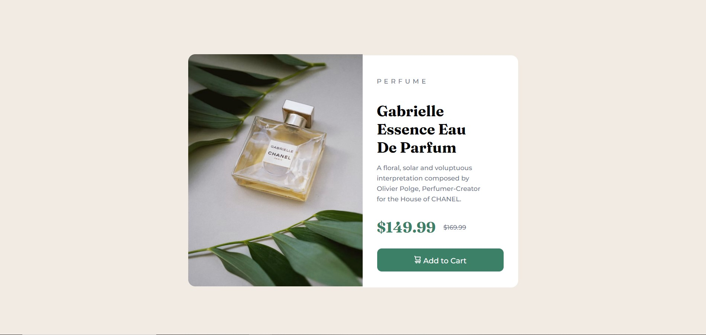

# Frontend Mentor - Product preview card component solution

This is a solution to the [Product preview card component challenge on Frontend Mentor](https://www.frontendmentor.io/challenges/product-preview-card-component-GO7UmttRfa). Frontend Mentor challenges help you improve your coding skills by building realistic projects. 

## Table of contents

- [Overview](#overview)
  - [The challenge](#the-challenge)
  - [Screenshot](#screenshot)
  - [Links](#links)
- [My process](#my-process)
  - [Built with](#built-with)
  - [What I learned](#what-i-learned)
  - [Continued development](#continued-development)

## Overview

### The challenge

Users should be able to:

- View the optimal layout depending on their device's screen size
- See hover and focus states for interactive elements

### Screenshot



### Links

- Solution URL: https://github.com/Vladmidir/product-preview-pard-component
- Live Site URL: https://vladmidir.github.io/product-preview-pard-component/

### Built with

- Semantic HTML5 markup
- CSS custom properties
- Flexbox
- CSS Grid
- Mobile-first workflow
- [React](https://reactjs.org/) - JS library
- [Next.js](https://nextjs.org/) - React framework
- [Styled Components](https://styled-components.com/) - For styles


### What I learned

I have learned how to make the webpage responsive using the picture element along with CSS @media.

```html
<picture>
      <source  media="(min-width: 1440px)" srcset="./images/image-product-desktop.jpg" width="375px">
      
</picture>
```

```css
@media (max-width: 1440px) {
  main{
    flex-direction: column;
  }
}
```

Also, I have learned how to change the element's style on hover.

```css
.button:hover {
    background-color: hsl(158, 36%, 20%);
}
```

### Continued development
In the future, I should use the ```html <span> ``` element instead of ```html <inline>```, as I was told it is a better practice.
